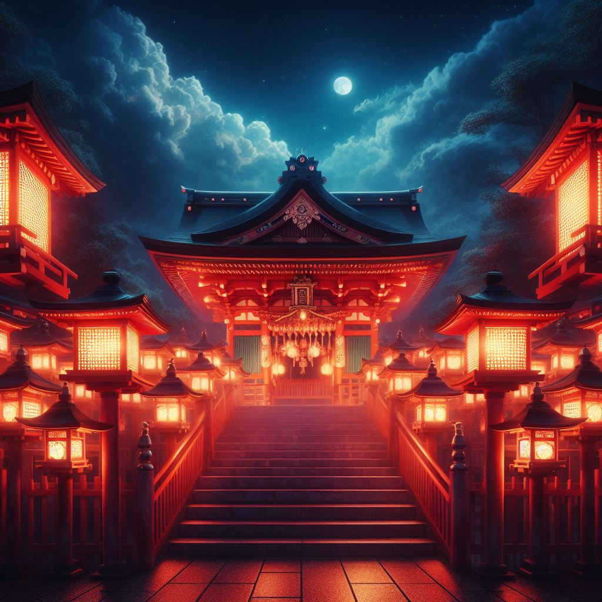

- Proccess of creating images with bing.com AI

# this is a header

[This is the websited for creating the image](http://www.bing.com/images/create)

The very first prompt was "shinto shrine in dark red background"

The second prompt was "shinto shrine with lanterns in dark red background with blue sky"

The third prompt was "abandoned shinto shrine with lanterns in dark background with a touch of red with dark blue sky with moon and clouds with a mountain and some trees with city light coming from afar"

The last prompt was "abandoned shinto shrine with lanterns in dark background with a touch of red with dark blue sky with moon and clouds with a mountain and some trees with city light coming from afar digital art" in which i specified the art style. Although it's worth noting that i liked the third prompt color palate abit more.

---
**Test**: This is atest
